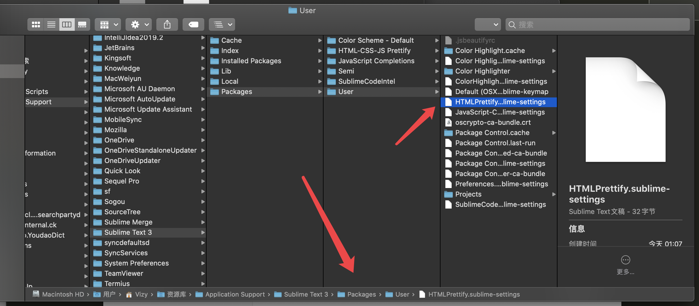
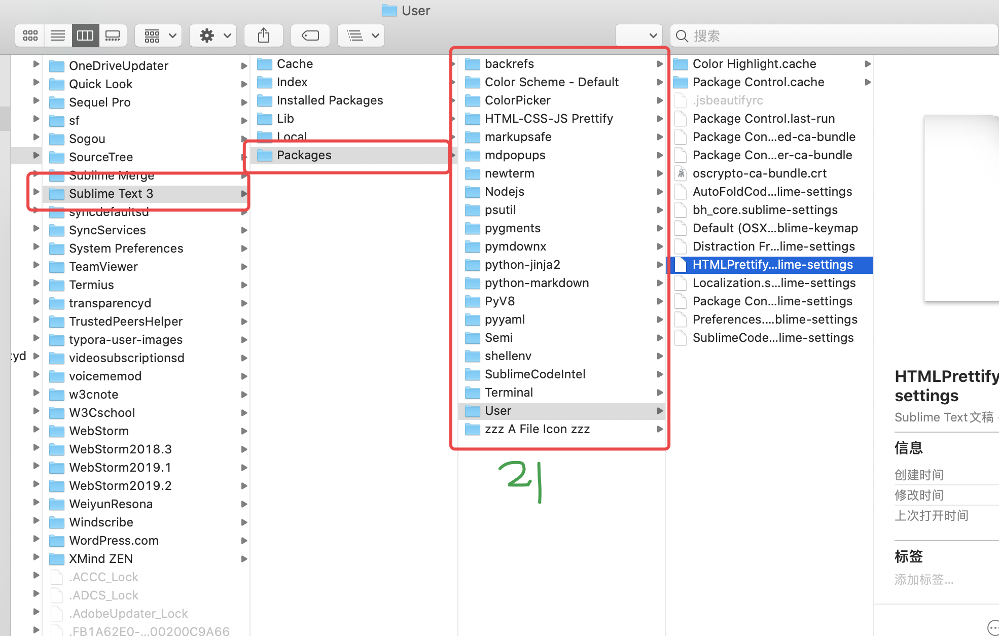

# 			配置后的sublime text

## 1-1.  `HTMLPrettify.sublime-settings`

> 位置如下
>
> 以下文件路径全在这里, 和这个相同
>
> ``/Users/Vizy/Library/Application Support/Sublime Text 3/Packages/User/SublimeCodeIntel.sublime-settings`
>
> 神奇的User文件夹📁





```json
{
  "format_on_save": true,
}
```

> 保存自动格式化
>
> 手动👋格式化快捷键: shift command h


## 1-2    `.jsbeautifyrc`

> 插件HTML-CSS-JS Prettify的配置文件
>
> 更具体, 如何格式化
>
> 该文件同其他文件一样是放在user目录里的, 不是项目根目录里的
>
> ⚠️该文件设置的保留空行, 对html文件里的**style标签里的内容**❗️无效, 对**注释中的内容**无效❗️
>
> > 所以html部分需要设置该条      `"preserve_newlines": false,`  或者    ` "max_preserve_newlines": 0,`
> >
> > 又因为js部分设置改行若为2, 只能保留一个空行, 若为n, 只能保留n-1个空行, 所以想要保留一行只能设置成2

```json
{
  "all":
  {
    "end_with_newline": true,
    "indent_size": 2,
    "max_preserve_newlines": 2,
    "preserve_newlines": true,
  },
  "html":
  {
    "indent_scripts": "normal",
    // "preserve_newlines": false,
    "max_preserve_newlines": 0,
  },
}

```


## 2. `Default (OSX).sublime-keymap`

> Sublime默认快捷键

```json
[
    {
        "keys": ["super+shift+o"],
        "command": "reopen_last_file"
    },
    {
        "keys": ["super+backspace"],
        "command": "run_macro_file",
        "args":
        {
            "file": "res://Packages/Default/Delete Line.sublime-macro"
        }
    },

    {

        "keys": ["super+delete"],
        "command": "run_macro_file",
        "args":
        {
            "file": "res://Packages/Default/Delete Line.sublime-macro"
        }
    },
    {
        "keys": ["ctrl+shift+k"],
        "command": "run_macro_file",
        "args":
        {
            "file": "res://Packages/Default/Delete to Hard BOL.sublime-macro"
        }
    },
    {
        "keys": ["alt+space"],
        "command": "auto_complete"
    },
    {
        "keys": ["super+."],
        "command": "bh_key",
        "args":
        {
            "plugin":
            {
                "type": ["__all__"],
                "command": "bh_modules.foldbracket"
            }
        }
    },

]

```

|      快捷键      |      更改前      |        更改后        |
| :--------------: | :--------------: | :------------------: |
| Command + Delete | 删除光标前面内容 | **==删除整行内容==** |
|     Ctrl + K     | 删除光标后面内容 |   删除光标后面内容   |
| Shift + Ctrl + K |   删除整行内容   |   删除光标前面内容   |

 

[官网](https://www.sublimecodeintel.com)

> Sublime Code Intelligence

 **A full-featured code intelligence and smart autocomplete engine for Sublime Text.**
*JavaScript, ES6, Mason, XBL, XUL, RHTML, SCSS, Python, HTML, Ruby, Python, XML, XSLT, Django, HTML5, Perl, CSS, Twig, Less, Smarty, Node.js, Tcl, TemplateToolkit, PHP.*

### Features[Permalink](https://www.sublimecodeintel.com/docs/welcome/#features)

- **Jump to Symbol Definition** - Jump to the file and line of the definition of a symbol.

  - > sublime 自身就带跳转
    >
    > 快捷键: **Ctrl + 点击** 跳转到定义处, 且可以跨文件跳转

- **Imports autocomplete** - Shows autocomplete with the available modules/symbols in real time.

  - > 只能提示出来本页面的符号(函数、变量…)
    >
    > 弹出提示面板

- **Function Call tooltips** - Displays information in the status bar about the working function.

- **Multiplatform** - Plugin should work in all three platforms (MacOS X, Windows and Linux).


##3. `Preferences.sublime-settings`

> Sublime自定义 ==**偏爱**== 参数选择🖌️

```json
{
    "always_show_minimap_viewport": true,
    "auto_complete_commit_on_tab": true,
    "bold_folder_labels": true,
    "draw_minimap_border": true,
    "ensure_newline_at_eof_on_save": true,
    "fade_fold_buttons": false,
    "font_size": 19,
    "highlight_line": true,
    "highlight_modified_tabs": true,
    "tab_size": 2,
    "translate_tabs_to_spaces": true,

    "ignored_packages": [
        "nodejs",
        "Vintage"
    ],
    "save_on_focus_lost": true,
    "show_encoding": true,
    "theme": "Adaptive.sublime-theme",
    "trim_trailing_white_space_on_save": true
}

```


##4. `bh_core.sublime-settings`

```json
{

    "content_highlight_bar": true,
    "show_in_minimap": true,
    "ignore_threshold": true,
    "high_visibility_style": "outline",
    "popup_line_context": 4,

    "bracket_styles":

    {
        // `default` and `unmatched` styles are special
        // styles. If they are not defined here,
        // they will be generated internally with
        // internal defaults.

        // `default` style defines attributes that
        // will be used for any style that does not
        // explicitly define that attribute.  So if
        // a style does not define a color, it will
        // use the color from the "default" style.
        "default":
        {
            "icon": "dot",
            // Support the old convention of `brackethighlighter.default`
            // for themes that already provide something.
            // As this has always been the only one we've provided
            // by default, all the others will use region-ish colors.
            "color": "region.yellowish brackethighlighter.default",
            "style": "outline"
        },

        // This particular style is used to highlight
        // unmatched bracket pairs.  It is a special
        // style.
        "unmatched":
        {
            "icon": "question",
            "color": "region.redish",
            "style": "outline"
        },
        // User defined region styles
        "curly":
        {
            "icon": "curly_bracket",
            "color": "region.purplish",
            // "style": "underline"
        },
        "round":
        {
            "icon": "round_bracket",
            "color": "region.yellowish",
            // "style": "underline"
        },
        "square":
        {
            "icon": "square_bracket",
            "color": "region.bluish",
            // "style": "underline"
        },
        "angle":
        {
            "icon": "angle_bracket",
            "color": "region.orangish",
            // "style": "underline"
        },
        "tag":
        {
            "icon": "tag",
            "color": "region.orangish",
            // "style": "underline"
        },
        "c_define":
        {
            "icon": "hash",
            "color": "region.yellowish",
            // "style": "underline"
        },
        "single_quote":
        {
            "icon": "single_quote",
            "color": "region.greenish",
            // "style": "underline"
        },
        "double_quote":
        {
            "icon": "double_quote",
            "color": "region.greenish",
            // "style": "underline"
        },
        "regex":
        {
            "icon": "star",
            "color": "region.greenish",
            // "style": "underline"
        }
    }

}

```

